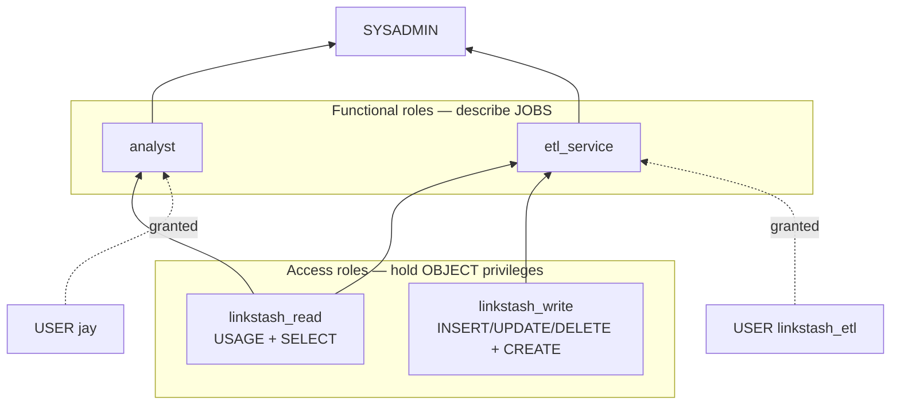

# 04-2 · Roles & grants in practice

> **Level:** Intermediate · **Prerequisites:** [04-1 The RBAC model](01_rbac_model.md)
> **Time:** 30 min · **Verified:** 2026-08-22 (Snowflake trial; Enterprise-only features flagged)

04-1 gave you the model. Nobody designs RBAC in the abstract though — you design it
for a specific set of objects and a specific set of jobs, and if you improvise it you
end up with one role per person and a re-grant every Tuesday. This module builds the
whole **linkstash analytics** access model in SQL, once, in the layout every mature
Snowflake account converges on.

---

## The pattern: access roles under functional roles

Two layers, and the split is the entire idea:



- **Access roles** answer *"what can be done to this data?"* — one per
  database-and-permission-level (`linkstash_read`, `linkstash_write`). They are
  granted objects, never people.
- **Functional roles** answer *"what is this person or job for?"* (`analyst`,
  `etl_service`). They are granted **access roles**, never objects.
- **Users** are granted functional roles only.

Why bother with two layers instead of granting the tables straight to `analyst`? The
day you add a second database, the read privileges for it are one new access role
granted into the existing functional roles — no per-person work, no touching users.
And when someone changes team you swap one role grant, not fifteen object grants. It
is the same instinct as IAM managed policies vs inline ones, except here composition
is the *only* mechanism.

---

## Step 1 — create the roles

`CREATE ROLE` belongs to **USERADMIN**, not ACCOUNTADMIN:

```sql
USE ROLE useradmin;                                     -- the role factory (04-1)

CREATE ROLE linkstash_read  COMMENT = 'access: read raw + analytics';
CREATE ROLE linkstash_write COMMENT = 'access: write analytics, load raw';
CREATE ROLE analyst         COMMENT = 'functional: humans writing SQL';
CREATE ROLE etl_service     COMMENT = 'functional: the loader job';
```

Fill in `COMMENT`. In six months `SHOW ROLES` is the only documentation of your access
model that cannot go stale, and an uncommented role nobody remembers never gets
deleted — it gets granted to one more person.

---

## Step 2 — object grants onto the access roles

Grants need `MANAGE GRANTS` or object ownership, so switch to **SECURITYADMIN**:

```sql
USE ROLE securityadmin;

-- read: the four-privilege minimum, spelled out (04-1)
GRANT USAGE  ON DATABASE linkstash_analytics                    TO ROLE linkstash_read;
GRANT USAGE  ON SCHEMA   linkstash_analytics.raw                TO ROLE linkstash_read;
GRANT USAGE  ON SCHEMA   linkstash_analytics.analytics          TO ROLE linkstash_read;
GRANT SELECT ON ALL TABLES IN SCHEMA linkstash_analytics.raw       TO ROLE linkstash_read;
GRANT SELECT ON ALL TABLES IN SCHEMA linkstash_analytics.analytics TO ROLE linkstash_read;
GRANT SELECT ON ALL VIEWS  IN SCHEMA linkstash_analytics.analytics TO ROLE linkstash_read;
```

Note `VIEWS` is a separate grant from `TABLES` — the typed views you built over
`raw_clicks` in [02-3](../02_sql_and_loading/03_semi_structured_json.md) are not
covered by a table grant, which is a five-minute confusion the first time.

Write privileges are the mutating verbs plus the right to create objects in the
schema:

```sql
-- write: mutate rows, and create new objects in the schemas it owns the work for
GRANT INSERT, UPDATE, DELETE, TRUNCATE
  ON ALL TABLES IN SCHEMA linkstash_analytics.raw       TO ROLE linkstash_write;
GRANT INSERT, UPDATE, DELETE, TRUNCATE
  ON ALL TABLES IN SCHEMA linkstash_analytics.analytics TO ROLE linkstash_write;
GRANT CREATE TABLE, CREATE VIEW, CREATE STAGE
  ON SCHEMA linkstash_analytics.analytics               TO ROLE linkstash_write;
GRANT USAGE ON DATABASE linkstash_analytics             TO ROLE linkstash_write;
GRANT USAGE ON SCHEMA linkstash_analytics.raw           TO ROLE linkstash_write;
GRANT USAGE ON SCHEMA linkstash_analytics.analytics     TO ROLE linkstash_write;
```

`linkstash_write` deliberately does **not** include `SELECT` — write and read are
separate access roles, and `etl_service` gets both. That's not pedantry: it means a
future "append-only ingestion" role is already expressible without touching anything.

---

## Step 3 — FUTURE grants (the one that saves you)

Everything above has a hole in it. **`ON ALL TABLES` is a one-time snapshot** — it
grants on the tables that exist at the instant you run it and nothing more. Tomorrow
`etl_service` creates `analytics.clicks_daily`, and `analyst` gets *"does not exist or
not authorized"* on a table that plainly exists. Diagnosing it burns an afternoon;
it's the second most common Snowflake access bug after the missing warehouse grant.

**FUTURE grants** are the standing rule:

```sql
USE ROLE securityadmin;

-- applies to every table/view created in these schemas FROM NOW ON
GRANT SELECT ON FUTURE TABLES IN SCHEMA linkstash_analytics.raw       TO ROLE linkstash_read;
GRANT SELECT ON FUTURE TABLES IN SCHEMA linkstash_analytics.analytics TO ROLE linkstash_read;
GRANT SELECT ON FUTURE VIEWS  IN SCHEMA linkstash_analytics.analytics TO ROLE linkstash_read;
GRANT INSERT, UPDATE, DELETE, TRUNCATE
  ON FUTURE TABLES IN SCHEMA linkstash_analytics.raw                  TO ROLE linkstash_write;

SHOW FUTURE GRANTS IN SCHEMA linkstash_analytics.analytics;   -- verify the standing rules
```

| | `ON ALL TABLES` | `ON FUTURE TABLES` |
|---|---|---|
| Applies to | tables existing **right now** | tables created **later** |
| Re-run needed after DDL? | **yes, every time** | no |
| Covers existing tables? | yes | **no** |

They are complements, not alternatives: **run `ALL` once to catch up, then `FUTURE`
to stay caught up.** That two-line pair is the correct idiom and the thing to
remember from this page.

Two real gotchas:

- **Future grants can be set at database level too** (`ON FUTURE TABLES IN DATABASE
  linkstash_analytics`), which then covers schemas you haven't created yet. But a
  *schema*-level future grant **overrides** the database-level one for that schema
  rather than adding to it — so pick one level per privilege and stay there.
- FUTURE grants don't apply to objects created by a **`CREATE … CLONE`** or moved in
  by rename in every case, and they don't retroactively fix the gap. When something
  looks unowned, `SHOW GRANTS ON TABLE …` and re-run the `ALL` grant.

---

## Step 4 — warehouse grants, i.e. cost control

Data grants without a warehouse grant execute nothing (04-1). But *which* warehouse
privilege you hand out is a budget decision:

```sql
USE ROLE securityadmin;
GRANT USAGE   ON WAREHOUSE dev_wh TO ROLE analyst;       -- run queries — the credit spender
GRANT USAGE, OPERATE ON WAREHOUSE dev_wh TO ROLE etl_service;  -- + resume/suspend for its job
GRANT MONITOR ON WAREHOUSE dev_wh TO ROLE analyst;       -- see queries & load, change nothing
-- MODIFY deliberately NOT granted: it is the resize privilege.
```

| Privilege | Lets the role | Cost exposure |
|---|---|---|
| `USAGE` | run queries on it | spends credits at the warehouse's current size |
| `OPERATE` | suspend / resume | small — mostly saves money |
| `MONITOR` | view queries, load, history | none |
| `MODIFY` | **resize**, change auto-suspend | **unbounded** |

`ALTER WAREHOUSE dev_wh SET WAREHOUSE_SIZE = '4X-LARGE'` is one statement, requires
`MODIFY`, and multiplies the burn rate of every subsequent query by 128× versus
X-Small. Nobody has to be malicious — someone debugs a slow query, resizes, forgets,
goes on holiday. **So RBAC here is a cost control, not just a security control:**
keep `MODIFY` with SYSADMIN (or a tiny `wh_admin` role), never on a role a human runs
ad-hoc SQL in. Also don't grant `MODIFY` merely so someone can *unstick* a warehouse
— `OPERATE` covers suspend/resume, which is what they actually want. Hard spend caps
are resource monitors, in [section 05](../05_performance_and_cost/README.md).

---

## Step 5 — wire the hierarchy up

Access roles into functional roles, functional roles into SYSADMIN and users:

```sql
USE ROLE securityadmin;

GRANT ROLE linkstash_read  TO ROLE analyst;        -- analysts read, full stop
GRANT ROLE linkstash_read  TO ROLE etl_service;    -- the loader reads…
GRANT ROLE linkstash_write TO ROLE etl_service;    -- …and writes

GRANT ROLE analyst     TO ROLE sysadmin;           -- roll up so SYSADMIN can manage its own objects
GRANT ROLE etl_service TO ROLE sysadmin;

GRANT ROLE analyst TO USER jay;                    -- people get functional roles only
```

Skipping the SYSADMIN roll-up is the classic omission: SYSADMIN owns
`linkstash_analytics` but can't see what these roles hold, so nobody except
ACCOUNTADMIN can audit or fix the tree — and you're back to working as root.

### Least privilege, per role

| Role | Read | Write | Create objects | Warehouse | Granted to |
|---|---|---|---|---|---|
| `linkstash_read` | ✅ raw + analytics | — | — | — | `analyst`, `etl_service` |
| `linkstash_write` | — | ✅ raw + analytics | ✅ in `analytics` | — | `etl_service` |
| `analyst` | ✅ (inherited) | ❌ | ❌ | `USAGE`, `MONITOR` on `dev_wh` | users |
| `etl_service` | ✅ (inherited) | ✅ (inherited) | ✅ (inherited) | `USAGE`, `OPERATE` | the service user |
| `sysadmin` | ✅ (owner) | ✅ (owner) | ✅ | `MODIFY` | a very short list of humans |
| `PUBLIC` | **nothing** | nothing | nothing | nothing | (everyone, automatically) |

---

## Step 6 — the service user (key-pair, not a password)

The ETL role needs a login of its own — never your personal user's credentials in a
scheduled job. Snowflake distinguishes **user types**, and service users authenticate
with a **key pair**, matching the connector setup from
[03-1](../03_python_and_snowpark/01_python_connector.md):

```sql
USE ROLE useradmin;
CREATE USER linkstash_etl
  TYPE = SERVICE                          -- no password, no MFA prompt, no human login
  RSA_PUBLIC_KEY = 'MIIBIjANBgkqhkiG9w0BAQ…'   -- the PUBLIC half of your key pair
  DEFAULT_ROLE = etl_service
  DEFAULT_WAREHOUSE = dev_wh
  COMMENT = 'linkstash loader — key-pair auth';

GRANT ROLE etl_service TO USER linkstash_etl;   -- DEFAULT_ROLE is a default, NOT a grant
```

That last line is not optional and the comment is the whole point: `DEFAULT_ROLE` only
says which role a session starts in — if the role was never granted, the connection
authenticates and then fails on the first statement. Two more notes: Snowflake has
been progressively **enforcing MFA for human (`PERSON`) users**, which is exactly why
automation should be a `SERVICE` user with a key rather than a person with a password;
and rotate keys with `ALTER USER … SET RSA_PUBLIC_KEY_2 = …` (two slots exist so you
can roll over with no downtime).

---

## Step 7 — test the denial (the payoff)

This is the part LocalStack could never do for you. Every role gets two checks: one
statement that must succeed, one that must fail.

```sql
USE ROLE analyst;
USE WAREHOUSE dev_wh;

SELECT count(*) FROM linkstash_analytics.raw.raw_clicks;      -- ✅ must succeed

INSERT INTO linkstash_analytics.raw.raw_clicks
  SELECT * FROM linkstash_analytics.raw.raw_clicks LIMIT 0;   -- ❌ must fail:
-- SQL access control error: Insufficient privileges to operate on table 'RAW_CLICKS'

ALTER WAREHOUSE dev_wh SET WAREHOUSE_SIZE = 'LARGE';          -- ❌ must fail (no MODIFY)
```

Then confirm the whole tree looks the way you drew it:

```sql
USE ROLE securityadmin;
SHOW GRANTS TO ROLE analyst;         -- inherited roles + direct privileges
SHOW GRANTS TO ROLE linkstash_read;  -- the four-privilege minimum, present?
SHOW GRANTS TO USER linkstash_etl;   -- ETL_SERVICE, not just PUBLIC
```

An access model where you've only ever watched things succeed is untested. Keep these
statements in a `grants_test.sql` next to the DDL and re-run it after any grant
change — it's seconds of `dev_wh` time and it catches the mistake that would
otherwise surface as a broken dashboard.

---

## Recap & next

- ✅ **Access roles hold objects, functional roles hold jobs, users hold functional
  roles.** Adding a database becomes one new access role, not N user edits.
- ✅ `USE ROLE useradmin` to create roles/users, `securityadmin` to grant,
  `sysadmin` to create objects — and **roll custom roles up to SYSADMIN**.
- ✅ **`ON ALL` is a snapshot, `ON FUTURE` is a standing rule** — run `ALL` once to
  catch up, `FUTURE` to stay caught up. Schema-level future grants *override*
  database-level ones.
- ✅ Warehouse privileges are a **budget decision**: `USAGE` spends, `OPERATE`
  suspends, `MONITOR` looks, **`MODIFY` resizes** — keep `MODIFY` off ad-hoc roles.
- ✅ Automation gets its own **`TYPE = SERVICE`** user with key-pair auth, and
  `DEFAULT_ROLE` still needs a real `GRANT ROLE`.
- ✅ **Test the denial**, every time. Real enforcement means a real test.

## Exercise

A new analytics table `analytics.clicks_daily` is created by the ETL job each month
into a *new* schema `analytics_2026_09`, created by `etl_service`. Analysts report
they can query last month's tables but not the new schema at all. You had already run
both `ON ALL TABLES` and `ON FUTURE TABLES IN SCHEMA analytics` grants. What's wrong,
and what's the fix that stops it recurring?

<details>
<summary>Solution</summary>

Two independent problems.

**1 — The future grant was scoped to the wrong level.** `ON FUTURE TABLES IN SCHEMA
linkstash_analytics.analytics` says nothing about tables in a *different* schema. New
schemas need a **database-level** future grant:

```sql
USE ROLE securityadmin;
GRANT USAGE  ON FUTURE SCHEMAS IN DATABASE linkstash_analytics TO ROLE linkstash_read;
GRANT SELECT ON FUTURE TABLES  IN DATABASE linkstash_analytics TO ROLE linkstash_read;
```

Note the **two** grants: `USAGE` on future *schemas* as well as `SELECT` on future
*tables*. Without schema `USAGE` the tables are invisible even with `SELECT` — the
four-privilege minimum again ([04-1](01_rbac_model.md)).

**2 — Ownership.** The new schema is owned by `etl_service` (it created it), so the
existing schema-level future grant on `analytics` is irrelevant to it, and only
`etl_service`, SYSADMIN and above can grant on it at all. Either have the ETL create
schemas while in a role that rolls up to SYSADMIN, or make the schema
`WITH MANAGED ACCESS` so grants are centralised with the schema owner instead of
scattered across object owners.

The durable fix is the database-level future grants above — set once, and every schema
and table the pipeline ever creates is readable by `linkstash_read` without anybody
running a grant again. Also worth adding to `grants_test.sql`: a monthly denial/allow
check as `analyst` against the newest schema.

</details>

**→ Next: [04-3 · Governance: masking, row access & network policies](03_data_governance.md)** —
the column, row and network controls that sit on top of RBAC.
