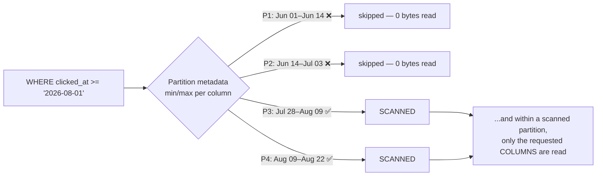

# 05-2 · Pruning, caching & query tuning

> **Level:** Intermediate · **Prerequisites:** [05-1 · How Snowflake bills you](01_credits_and_billing.md)
> **Time:** ~30 min · **Verified:** 2026-08-22 (Snowflake trial; Enterprise-only features flagged)

**Snowflake has no indexes.** No `CREATE INDEX`, no covering index, no query hints,
no `ANALYZE`. Everything you learned about Postgres tuning — B-trees, index-only
scans, hint pragmas — has no surface to act on here.

What it has instead is one mechanism: **read fewer bytes**. Every performance
technique in this module is a way of not reading data, and because compute is
billed by the second (05-1), not reading data *is* not spending money. Latency and
cost are the same optimisation, which is unusually convenient.

---

## Micro-partitions: the whole performance model

Snowflake automatically slices every table into **micro-partitions**:

- **~50–500 MB of uncompressed data each** (much less on disk after compression),
- **columnar inside** — each column stored and compressed separately,
- **immutable** — an update rewrites a partition, never edits one in place,
- and each carries **metadata**: min/max value per column, distinct counts, null
  counts, row count.

That metadata is the index substitute. Before touching storage, Snowflake compares
your `WHERE` clause against every partition's min/max and **skips the ones that
cannot possibly match**. That's **pruning**, and it is the only reason a query over
a billion rows can come back in two seconds.



Two independent axes of savings, and you control both:

| Axis | Controlled by | Metric to watch |
|---|---|---|
| **Partition pruning** (which rows' partitions) | your `WHERE` clause + how the data is clustered | *partitions scanned / partitions total* |
| **Column pruning** (which columns) | your `SELECT` list | *bytes scanned* |

---

## Writing filters that actually prune

Pruning only works if Snowflake can compare your predicate to a column's min/max
**directly**. Wrap the column in anything and the metadata becomes useless — it has
stats for `clicked_at`, not for `DATE(clicked_at)`.

| Predicate | Prunes? | Why |
|---|---|---|
| `clicked_at >= '2026-08-01'` | ✅ | Range compares straight to min/max |
| `country = 'IN'` | ✅ | Equality on a column with stats |
| `link_id IN (12, 88, 401)` | ✅ | Set of equalities |
| `DATE(clicked_at) = '2026-08-01'` | ❌ | Function-wrapped — stats don't apply |
| `TO_CHAR(clicked_at,'YYYY-MM') = '2026-08'` | ❌ | Same problem, dressed up |
| `user_agent LIKE '%Firefox%'` | ❌ | Leading wildcard: min/max says nothing |
| `user_agent LIKE 'Mozilla/5%'` | ⚠️ | Prefix *can* prune if the column is clustered on it |
| `LOWER(country) = 'in'` | ❌ | Function-wrapped again |
| `link_id = (SELECT MAX(link_id) FROM links)` | ⚠️ | Prunes only if the subquery resolves before the scan |

The fix is almost always **move the function to the other side of the operator**:

```sql
-- ❌ No pruning: every partition is opened to evaluate DATE() row by row.
SELECT COUNT(*) FROM analytics.clicks
WHERE  DATE(clicked_at) = '2026-08-01';

-- ✅ Prunes: a half-open range on the bare column, comparable to min/max metadata.
SELECT COUNT(*) FROM analytics.clicks
WHERE  clicked_at >= '2026-08-01'
  AND  clicked_at <  '2026-08-02';
```

Same result, same readability, often 10–100× less data read. `LOWER(country) = 'in'`
becomes `country = 'IN'` plus a normalisation on *load* — do the transformation
once at write time, not on every partition at read time.

---

## `SELECT *` is a bill, not a shortcut

In a row store, `SELECT *` costs roughly what `SELECT one_column` costs — the row
is on the page either way. In a **columnar** store, each column is a separate set
of blocks: you pay for exactly the columns you name.

`analytics.clicks` has 14 columns, and `raw_payload` (a `VARIANT` from section 02)
is most of the bytes:

```sql
-- ❌ 12.4 GB scanned. raw_payload alone is ~85% of it, and you didn't look at it.
SELECT * FROM analytics.clicks WHERE clicked_at >= '2026-08-01';

-- ✅ 0.31 GB scanned. Three narrow columns out of fourteen.
SELECT link_id, clicked_at, country FROM analytics.clicks
WHERE  clicked_at >= '2026-08-01';
```

**~40× less data for deleting one character.** This is the cheapest win in the
entire course, it needs no DDL, no clustering, no resize, and it applies to every
query you will ever write against a wide table. `SELECT *` is fine for eyeballing
ten rows with a `LIMIT`; it is never fine in a view, a dashboard, a job, or a
`pd.read_sql`.

The same logic reaches the Python side (section 03): `cur.fetchall()` on a
`SELECT *` also pays egress and client memory for columns pandas will drop.

---

## The three caches

Snowflake caches at three levels, and they behave nothing alike. Knowing which one
you just hit explains most "why was it fast this time?" moments.

| Cache | Lives in | Serves | Warehouse needed? | Invalidated by |
|---|---|---|---|---|
| **Result cache** | Cloud services layer | **Byte-identical query text**, same role/context, underlying data unchanged | **No — the query is free** | Any DML on the tables, ~24 h age (extended to 31 days if re-used), non-deterministic functions, changed masking policy |
| **Local disk (SSD) cache** | The warehouse's own nodes | Micro-partitions previously read by *any* query on that warehouse | Yes | **Warehouse suspend or resize — the cache is gone** |
| **Metadata cache** | Cloud services layer | `COUNT(*)`, `MIN`/`MAX` on a column, `SHOW`, row counts, `INFORMATION_SCHEMA` | **No** | Table DML |

### Result cache — the only free query

```sql
-- Run this twice in a row. First run: warehouse resumes, scans, bills ≥60 s.
SELECT link_id, COUNT(*) AS clicks
FROM   analytics.clicks
WHERE  clicked_at >= '2026-08-01'
GROUP BY 1 ORDER BY 2 DESC LIMIT 10;
```

The second run returns in ~100 ms with **`bytes_scanned = 0`** and no warehouse
compute — you can even get the result with the warehouse suspended. That's why the
dashboard exercise in 05-1 could drop to near-zero cost.

Things that quietly defeat it: `CURRENT_TIMESTAMP()`/`RANDOM()` in the query, a
whitespace or alias change (matching is on the *exact* text), a different role
whose masking policies could change the output, and any write to the underlying
tables. For genuinely time-based dashboards, round the boundary
(`DATE_TRUNC('hour', CURRENT_TIMESTAMP())`) so consecutive refreshes produce
identical SQL and hit the cache.

```sql
-- Diagnostics: prove a cache hit, and temporarily disable it for honest benchmarking.
ALTER SESSION SET USE_CACHED_RESULT = FALSE;   -- ⚠️ costs money; set back to TRUE
```

### Local SSD cache — the real price of `AUTO_SUSPEND = 60`

The second cache is warehouse-local and **dies on suspend**. This is the honest
trade-off behind the aggressive auto-suspend advice:

- `AUTO_SUSPEND = 60`: minimum idle billing, but a query 90 seconds after the last
  one re-reads its partitions from remote storage (a "cold" warehouse).
- `AUTO_SUSPEND = 600`: warm SSD cache for repeat/overlapping scans, but you pay
  for up to 10 idle minutes each time.

**Which wins?** Do the arithmetic rather than picking a side. On an X-Small,
540 extra idle seconds ≈ 0.15 credits. If your warm cache saves ~3 seconds per
query, you'd need ~180 queries in that window to break even. Interactive
warehouses serving a busy team can clear that bar; your dev warehouse cannot.
**Default to 60, raise it only with evidence.**

---

## Reading the Query Profile

Snowsight → **Query History** → click a query → **Query Profile**. It's a DAG of
operators plus statistics, and you can read the four things that matter in under a
minute.

| What to look at | Where | Healthy | Trouble |
|---|---|---|---|
| **Partitions scanned / total** | TableScan node stats | small fraction | **scanned ≈ total** ⇒ no pruning: fix the predicate, or consider clustering |
| **Bytes spilled to local storage** | Query-level statistics | 0 | > 0 ⇒ intermediate results exceeded RAM — **warehouse too small** |
| **Bytes spilled to remote storage** | Query-level statistics | 0 | > 0 ⇒ badly too small, or an exploding join. **This is the worst signal in the profile** |
| **Rows out ≫ rows in on a Join** | Join node | comparable | ⇒ **exploding join**: a missing/duplicated key producing a partial cross product |
| **Most expensive operator** | Highlighted in the DAG | — | Where your time went. Start there, ignore the rest |

Three reflexes worth memorising:

- **Bad pruning is a query problem first.** Fix the `WHERE` clause before you
  reach for clustering, and clustering before you reach for a bigger warehouse.
- **Spilling is a size problem.** No amount of rewriting fixes a genuine 200 GB
  sort on an X-Small — size up, run it, size back down (05-1 showed that's roughly
  cost-neutral). But check for an exploding join first: spilling caused by
  accidentally producing 40× the rows is a *join* bug, and a bigger warehouse just
  makes the wrong answer arrive faster.
- **`Bytes scanned from cache = 100%`** means you were served entirely from the
  local SSD cache — great, and a reason not to trust that timing as a benchmark.

You can get most of the same signals in SQL, which is what you'd do in a job:

```sql
-- Pruning report across yesterday's queries. The ratio is the signal:
-- close to 1.0 means Snowflake read almost everything to answer you.
SELECT LEFT(query_text, 50)              AS query,
       partitions_scanned,
       partitions_total,
       ROUND(partitions_scanned / NULLIF(partitions_total, 0), 3) AS scan_ratio,
       ROUND(bytes_spilled_to_local_storage  / POWER(1024, 3), 2) AS spill_local_gb,
       ROUND(bytes_spilled_to_remote_storage / POWER(1024, 3), 2) AS spill_remote_gb
FROM   snowflake.account_usage.query_history
WHERE  start_time >= DATEADD(day, -1, CURRENT_TIMESTAMP())
  AND  partitions_total > 0
ORDER BY partitions_scanned DESC
LIMIT 10;
```

```
QUERY                                  | PARTITIONS_SCANNED | PARTITIONS_TOTAL | SCAN_RATIO | SPILL_LOCAL_GB | SPILL_REMOTE_GB
SELECT * FROM analytics.clicks ORDER B | 1284               | 1284             | 1.000      | 4.20           | 1.05
SELECT COUNT(*) FROM analytics.clicks  | 1284               | 1284             | 1.000      | 0.00           | 0.00
SELECT link_id, COUNT(*) FROM analytic | 61                 | 1284             | 0.048      | 0.00           | 0.00
```

Row 1: no pruning **and** remote spilling — the two worst signals together. Row 2:
`scan_ratio = 1.0` because `DATE(clicked_at)` defeated pruning. Row 3 is what a
tuned query looks like: 4.8% of the table.

---

## Before / after: one real tuning pass

The offending query — "clicks per link for August, plus the raw payload someone
added to the `SELECT` once and never removed":

```sql
-- ❌ BEFORE: 1284/1284 partitions, 12.4 GB scanned, 96 s on X-Small, spilled to remote.
SELECT *
FROM   analytics.clicks c
JOIN   analytics.links  l ON l.link_id = c.link_id
WHERE  TO_CHAR(c.clicked_at, 'YYYY-MM') = '2026-08'   -- function ⇒ no pruning
ORDER BY c.clicked_at DESC;                            -- sorts 40 M rows nobody reads
```

Three independent fixes, none of them clever:

```sql
-- ✅ AFTER: 61/1284 partitions, 0.28 GB scanned, 2.9 s on the same X-Small.
SELECT c.link_id, l.slug, COUNT(*) AS clicks   -- 1. column pruning: 3 cols, not 14
FROM   analytics.clicks c
JOIN   analytics.links  l ON l.link_id = c.link_id
WHERE  c.clicked_at >= '2026-08-01'            -- 2. bare column ⇒ partition pruning
  AND  c.clicked_at <  '2026-09-01'
GROUP BY 1, 2                                  -- 3. aggregate first; no giant sort
ORDER BY clicks DESC
LIMIT 50;
```

**44× less data, 33× faster, ~0.017 credits instead of ~0.027 — and it would be
the same ~33× on a table 100× larger.** Note the warehouse never changed. That's
the order of operations: **query shape → clustering → warehouse size.** Most teams
try that list backwards, which is why their bill is what it is.

---

## Clustering: the lever you usually shouldn't pull

Tables are **naturally clustered by load order**. If you load clicks daily, the
rows for one day land together in a few partitions, so `clicked_at` filters prune
beautifully with no effort from you. **That covers most tables, and it is free.**

Clustering only becomes a question when a **large** table's selective filters
*don't* match how it was loaded — e.g. a multi-TB `clicks` table loaded by arrival
time but filtered mostly by `country`.

```sql
-- Inspect first. Never cluster on a hunch.
SELECT SYSTEM$CLUSTERING_INFORMATION('analytics.clicks', '(clicked_at)');
```

```json
{
  "cluster_by_keys" : "LINEAR(clicked_at)",
  "total_partition_count" : 1284,
  "average_overlaps" : 0.94,
  "average_depth" : 1.62,
  "partition_depth_histogram" : { "00000": 0, "00001": 981, "00002": 264, "00004": 39 }
}
```

`average_depth` near 1 means a value lives in ~1 partition — **excellent natural
clustering, do nothing.** Depth in the tens or hundreds on a column you filter on
constantly is the case for a clustering key.

```sql
-- Defines a clustering key AND enrolls the table in Automatic Clustering,
-- a serverless background service that reorganises partitions as you write.
ALTER TABLE analytics.clicks CLUSTER BY (clicked_at, country);
```

Three honest warnings:

- **Automatic Clustering is a paid, serverless service** — billed in credits
  outside any warehouse, continuously, as new data arrives. On a churning table it
  can cost more than the queries it speeds up. Check
  `SNOWFLAKE.ACCOUNT_USAGE.AUTOMATIC_CLUSTERING_HISTORY` after enabling it.
- **Don't cluster small tables.** Under a few hundred GB the reorganisation cost
  exceeds any scan saving, and `links` (thousands of rows, one partition) can't be
  pruned further at all. `analytics.clicks` on a trial is a *small* table. **This
  is a production-scale lever you should be able to discuss, not one you should
  enable this week.**
- **Low-cardinality first, and few keys.** 3–4 columns maximum, ordered
  lowest-cardinality first (`country` before `clicked_at` before `link_id`). A key
  on a near-unique column is expensive and buys nothing.

`ALTER TABLE ... DROP CLUSTERING KEY` stops the service and the billing. Neighbouring
levers, so you can name them in an interview:

| Feature | Edition | Use when |
|---|---|---|
| **Materialized views** | **Enterprise+** | A small, expensive, repeated aggregate over a big slow-changing table. Auto-maintained — and auto-billed as a serverless service |
| **Search Optimization Service** | **Enterprise+**, paid | Highly selective point lookups (`WHERE id = ...`) on a huge table where clustering can't help |
| **Transient tables** | All | Data you can reload — no Fail-safe, cheaper storage (05-1, 05-3) |

Both of the Enterprise features are "buy performance with a background credit
stream". Reach for query shape and column pruning first — they're free.

---

## `STATEMENT_TIMEOUT_IN_SECONDS`: the runaway guard

Snowflake's default statement timeout is **172,800 seconds — two days**. A
Cartesian join from a typo will happily grind for 48 hours on whatever warehouse
it landed on. Cap it, everywhere:

```sql
-- Set on the warehouse (applies to everything running there), the account,
-- the user, or the session. The lowest applicable value wins.
ALTER WAREHOUSE dev_wh SET STATEMENT_TIMEOUT_IN_SECONDS = 600;      -- dev: 10 min is plenty
ALTER WAREHOUSE etl_wh SET STATEMENT_TIMEOUT_IN_SECONDS = 7200;     -- ETL: 2 h, still bounded

-- And stop queued queries from piling up behind a stuck one:
ALTER WAREHOUSE dev_wh SET STATEMENT_QUEUED_TIMEOUT_IN_SECONDS = 300;
```

One `ALTER` per warehouse converts an unbounded worst case into a bounded one.
Pair it with a resource monitor ([05-3](03_cost_guardrails.md)) and the tail risk
of your account is something you can actually state a number for.

---

## Recap & next

- ✅ **No indexes.** Performance = **micro-partitions** (~50–500 MB, columnar,
  immutable, min/max metadata) + **pruning**, and pruning saved is money saved.
- ✅ Filters prune only against a **bare column**. `DATE(col) = x`,
  `LOWER(col) = x` and `LIKE '%x%'` read everything — rewrite as ranges or
  normalise at load time.
- ✅ **`SELECT *` is the most expensive habit in a columnar store.** Naming the
  columns you need is the cheapest optimisation in this course.
- ✅ Three caches: **result cache** (free, no warehouse, ~24 h, exact text),
  **local SSD cache** (dies on suspend — the real cost of `AUTO_SUSPEND = 60`),
  **metadata cache** (`COUNT(*)`/`MIN`/`MAX` for free).
- ✅ Query Profile: **partitions scanned/total** = pruning, **spilling** =
  warehouse too small (or an exploding join), plus the most expensive operator.
  Same signals live in `QUERY_HISTORY`.
- ✅ Order of operations: **query shape → clustering → warehouse size.**
  Automatic Clustering is paid and for big tables whose filters don't match load
  order — **don't cluster small tables**; check `SYSTEM$CLUSTERING_INFORMATION` first.
- ✅ `STATEMENT_TIMEOUT_IN_SECONDS` defaults to **two days** — lower it on every
  warehouse.

## Exercise

A teammate reports that this nightly rollup "got slow" — 40 minutes on a Medium
warehouse, with 2.1 GB spilled to remote storage and `partitions_scanned = 1284`
of `partitions_total = 1284`:

```sql
SELECT l.slug, c.country, COUNT(*) AS clicks, MAX(c.clicked_at) AS last_click
FROM   analytics.clicks c
JOIN   analytics.links  l ON l.slug = SPLIT_PART(c.landing_url, '/', -1)
WHERE  TO_CHAR(c.clicked_at, 'YYYY-MM-DD') >= '2026-08-01'
  AND  LOWER(c.country) IN ('in', 'us')
GROUP BY 1, 2;
```

Name every reason it's slow and give the tuned version. Which fix do you ship
first, and is a bigger warehouse the answer?

<details>
<summary>Solution</summary>

**Four separate problems, all visible in the text:**

1. **`TO_CHAR(c.clicked_at, ...) >= '2026-08-01'`** — function-wrapped column, so
   zero pruning; that alone explains `1284/1284`. (It also happens to work only by
   luck: it's a *string* comparison that gives the right answer for ISO dates and
   silently wrong ones for any other format.)
2. **`LOWER(c.country) IN (...)`** — function-wrapped again, no pruning on
   `country` either.
3. **`ON l.slug = SPLIT_PART(c.landing_url, '/', -1)`** — a function on the join
   key, so no hash join on a clean column and no join pruning. If `landing_url`
   ever yields a slug matching multiple `links` rows, this is also the exploding
   join behind that 2.1 GB remote spill.
4. **No `LIMIT`/date upper bound** — the query is open-ended, so it grows every
   day; "got slow" is just the table getting bigger while the query was always
   unprunable.

**Tuned:**

```sql
SELECT l.slug, c.country, COUNT(*) AS clicks, MAX(c.clicked_at) AS last_click
FROM   analytics.clicks c
JOIN   analytics.links  l ON l.link_id = c.link_id   -- real key, no function
WHERE  c.clicked_at >= '2026-08-01'                  -- bare column ⇒ prunes
  AND  c.clicked_at <  '2026-09-01'                  -- bounded window
  AND  c.country IN ('IN', 'US')                     -- normalise on load, not on read
GROUP BY 1, 2;
```

**Ship order.** The date predicate first — it's one line and it's what turns
1284 partitions into ~60. Then the join key, which is both a correctness fix and
the likely cause of the spill.

**Is a bigger warehouse the answer? No** — and this is the interview-grade part.
The spill says "too small for the data volume it's processing", but the reason it's
processing that volume is a full-table scan plus a possible partial cross product.
Sizing up to Large would make the same 2.1 GB spill happen twice as fast at twice
the rate: roughly the same credits, same wrong answer, and a permanently oversized
warehouse for every other job on it. Fix the shape; then, if it still spills,
size up for that job only and size back down.

</details>

**→ Next: [05-3 · Cost guardrails you actually ship](03_cost_guardrails.md)**
