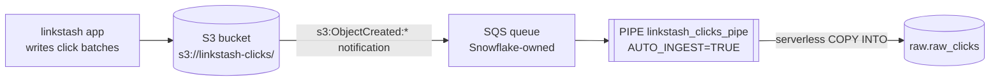

# 06-1 · Continuous ingestion with Snowpipe

> **Level:** Intermediate · **Prerequisites:** [05-3 Cost guardrails](../05_performance_and_cost/03_cost_guardrails.md)
> **Time:** ~30 min · **Verified:** 2026-08-22 (Snowflake trial; Enterprise-only features flagged)

In [02-2](../02_sql_and_loading/02_stages_and_copy_into.md) you loaded files by
running `COPY INTO` yourself. That works right up to the moment the data arrives all
day: nobody wants a human — or a warehouse spinning up every five minutes — babysitting
an S3 prefix. **Snowpipe** inverts the control flow. The bucket tells Snowflake a file
appeared, and Snowflake loads it on compute you don't manage.

---

## Batch `COPY INTO` vs Snowpipe

Same `COPY INTO` semantics underneath; completely different operational model.

| | `COPY INTO` (batch) | Snowpipe (continuous) |
|---|---|---|
| **Who triggers it** | you — a script, a task, a human in Snowsight | a cloud-storage event notification |
| **Latency** | whenever you next run it | typically ~1 minute after the file lands |
| **Compute billed** | *your* warehouse, 60-second minimum per resume | **serverless** — Snowflake-managed compute + a per-file overhead |
| **Sizing knob** | warehouse size (you tune it) | none; Snowflake scales the load itself |
| **Duplicate protection** | load metadata on the table, ~64 days | load history per *pipe*, ~14 days |
| **Errors surface** | in your session, immediately | nowhere — you go read `COPY_HISTORY` |
| **Best for** | scheduled bulk, backfills, reloads, one-offs | a trickle of files arriving continuously |

The honest summary: **batch for bulk, Snowpipe for trickle.** A nightly 5 GB export is
cheaper and simpler as one `COPY INTO` on an `XSMALL` warehouse — one 60-second billing
minimum, one place to read the error. A file every 30 seconds from a click stream is
miserable as batch (either latency or a warehouse that never sleeps) and is exactly
what Snowpipe is for. Both can coexist: Snowpipe for the live feed, `COPY INTO` for the
historical reload when you change the schema.

---

## The architecture



If you did the AWS course, you have already built the left two-thirds of this: it is
an **S3 event notification → SQS** setup, no different from the ones you wired to
Lambda. The only new part is that the queue belongs to Snowflake — creating the pipe
hands you its ARN and you point the bucket at it. Snowflake polls its own queue,
matches each object key against the pipe's stage path, and runs the `COPY`.

Three objects, in dependency order:

1. **Storage integration** — the identity Snowflake uses to read your bucket (IAM role, no keys).
2. **External stage** — a named pointer at `s3://bucket/prefix/` using that integration.
3. **Pipe** — a stored `COPY INTO` statement plus `AUTO_INGEST = TRUE`.

---

## 1. Storage integration (the AWS trust dance)

```sql
-- Requires ACCOUNTADMIN (or a role with CREATE INTEGRATION) — this is account-level.
CREATE OR REPLACE STORAGE INTEGRATION linkstash_s3_int
  TYPE = EXTERNAL_STAGE
  STORAGE_PROVIDER = 'S3'
  STORAGE_AWS_ROLE_ARN = 'arn:aws:iam::123456789012:role/snowflake-linkstash'
  STORAGE_ALLOWED_LOCATIONS = ('s3://linkstash-clicks/clicks/');   -- least privilege: one prefix

DESC INTEGRATION linkstash_s3_int;   -- read two values back out
```

`DESC` gives you `STORAGE_AWS_IAM_USER_ARN` and `STORAGE_AWS_EXTERNAL_ID`. You already
know what to do with them from [IAM](../04_security_and_rbac/01_rbac_model.md): edit
the role's **trust policy** so that principal can `sts:AssumeRole` with that
`sts:ExternalId` condition, and give the role `s3:GetObject`/`ListBucket` on the prefix.

The external ID is the point of the two-step: it's the standard **confused-deputy**
guard, so another Snowflake account can't ask the same shared principal to assume
*your* role. The role ARN is fixed in the integration first, the trust is granted
second — chicken-and-egg by design.

---

## 2. External stage

```sql
CREATE OR REPLACE FILE FORMAT linkstash_analytics.raw.clicks_json_ff
  TYPE = JSON
  STRIP_OUTER_ARRAY = TRUE;          -- one JSON array per file → one row per element

CREATE OR REPLACE STAGE linkstash_analytics.raw.s3_clicks_stage
  URL = 's3://linkstash-clicks/clicks/'
  STORAGE_INTEGRATION = linkstash_s3_int
  FILE_FORMAT = linkstash_analytics.raw.clicks_json_ff;

LIST @linkstash_analytics.raw.s3_clicks_stage;   -- proves the credentials work, loads nothing
```

`LIST` is the cheap smoke test — it uses no warehouse and fails loudly if the trust
policy is wrong. Do this before creating the pipe; debugging a silent pipe is much
worse than debugging a `LIST`.

---

## 3. The pipe

```sql
CREATE OR REPLACE PIPE linkstash_analytics.raw.linkstash_clicks_pipe
  AUTO_INGEST = TRUE
  AS
  COPY INTO linkstash_analytics.raw.raw_clicks (payload, source_file)
  FROM (
      SELECT $1, METADATA$FILENAME          -- keep the raw JSON in VARIANT, plus provenance
      FROM @linkstash_analytics.raw.s3_clicks_stage
  )
  FILE_FORMAT = (FORMAT_NAME = linkstash_analytics.raw.clicks_json_ff);
```

Land it **untyped in `VARIANT`** and cast later (06-2). A pipe you have to recreate
every time a producer adds a field is a pipe that will be broken most weeks.

Two constraints worth knowing before you design around them: a pipe's `COPY` supports
only simple `SELECT`-from-stage transformations (casts, `METADATA$FILENAME`, column
reordering — no joins, no aggregates), and `ON_ERROR = ABORT_STATEMENT` is not
supported, because there is no statement to abort. A bad file gets skipped and logged.

Now wire the notification:

```sql
SHOW PIPES IN SCHEMA linkstash_analytics.raw;
```

```
+-------------------------+---------------+--------------------------------------------------+
| name                    | pattern       | notification_channel                             |
|-------------------------+---------------+--------------------------------------------------|
| LINKSTASH_CLICKS_PIPE   | NULL          | arn:aws:sqs:us-east-1:...:sf-snowpipe-AIDA...    |
+-------------------------+---------------+--------------------------------------------------+
```

Copy `notification_channel` into an S3 event notification for `s3:ObjectCreated:*` on
that prefix (`aws s3api put-bucket-notification-configuration`, or the console). One
queue serves every pipe in your account; the prefix filter on each pipe's stage decides
which pipe actually loads a given object.

Files that were already in the bucket before the notification existed won't fire an
event. Backfill them once:

```sql
ALTER PIPE linkstash_analytics.raw.linkstash_clicks_pipe REFRESH;   -- recent files only (~7 days)
```

---

## Monitoring: three commands

```sql
SELECT SYSTEM$PIPE_STATUS('linkstash_analytics.raw.linkstash_clicks_pipe');
```

```json
{"executionState":"RUNNING","pendingFileCount":3,
 "lastReceivedMessageTimestamp":"2026-08-22T09:14:02Z",
 "lastForwardedMessageTimestamp":"2026-08-22T09:14:02Z",
 "notificationChannelName":"arn:aws:sqs:..."}
```

Read it as a diagnosis, not a status light:

- `executionState: RUNNING` + `pendingFileCount` climbing → files arriving faster than they load.
- `lastReceivedMessageTimestamp` missing or stale → **the notification never reached Snowflake.** The bucket config or the queue ARN is wrong; the pipe itself is fine.
- Received but nothing loaded → the event arrived for a key outside the stage's prefix, or the `COPY` is erroring.
- `STALE_*` / `PAUSED` → the pipe was paused (`ALTER PIPE ... SET PIPE_EXECUTION_PAUSED = TRUE`), or paused itself after repeated failures.

```sql
-- Per-file outcome, including the rows Snowpipe silently rejected.
SELECT file_name, status, row_count, row_parsed, first_error_message, last_load_time
FROM TABLE(INFORMATION_SCHEMA.COPY_HISTORY(
        TABLE_NAME => 'linkstash_analytics.raw.raw_clicks',
        START_TIME => DATEADD(hour, -2, CURRENT_TIMESTAMP())))
ORDER BY last_load_time DESC;
```

```
+----------------------------+-------------+-----------+------------+---------------------+
| FILE_NAME                  | STATUS      | ROW_COUNT | ROW_PARSED | FIRST_ERROR_MESSAGE |
|----------------------------+-------------+-----------+------------+---------------------|
| clicks/2026-08-22T0914.json| LOADED      |       812 |        812 | NULL                |
| clicks/2026-08-22T0909.json| PARTIALLY_L |       799 |        800 | Error parsing JSON  |
+----------------------------+-------------+-----------+------------+---------------------+
```

**`COPY_HISTORY` is the alert you actually need.** A Snowpipe failure is invisible —
no session, no exception, nobody paged. Schedule a query over it (a task, in 06-2)
that fires when `status <> 'LOADED'` appears, or you will find out from a dashboard
that looks slightly wrong three weeks later.

For spend, `PIPE_USAGE_HISTORY` breaks out credits and bytes per pipe:

```sql
SELECT pipe_name, SUM(credits_used) AS credits, SUM(files_inserted) AS files
FROM SNOWFLAKE.ACCOUNT_USAGE.PIPE_USAGE_HISTORY
WHERE start_time > DATEADD(day, -7, CURRENT_TIMESTAMP())
GROUP BY 1;
```

---

## Serverless billing and the small-files problem

Snowpipe does **not** use your warehouse — which is the good news (nothing to
right-size, no 60-second minimum, and it doesn't collide with the interactive work on
`dev_wh`) and also why it doesn't show up in `WAREHOUSE_METERING_HISTORY`. You are
billed for the serverless compute that does the load **plus a per-file overhead**
(published as roughly 0.06 credits per 1,000 files at the time of writing).

That overhead is the whole cost story:

| Ingest pattern | Files/day | Overhead credits/day |
|---|---|---|
| One 100 MB file per hour | 24 | ~0.0014 |
| One 1 MB file per minute | 1,440 | ~0.09 |
| One 5 KB file per second | 86,400 | **~5.2** |

The last row is the **small-files problem**, and it is the single most common way teams
overspend on Snowpipe: you pay per file, so 86,400 tiny files cost thousands of times
the overhead of the same bytes in 24 files — before you count the compute wasted opening
each one. Snowflake's own guidance is to aim for files in the ~100–250 MB compressed
range; in practice, batch on the producer side (Kinesis Firehose, an aggregating writer,
a buffer that flushes on size *or* a timeout) so files are a sensible size. Buffering
for 60 seconds costs you 60 seconds of latency and can cut ingest cost by an order of
magnitude.

**Snowpipe Streaming** is the answer when you genuinely need row-level latency: an SDK
(Java/Python client, and the Snowflake Connector for Kafka on top of it) writes rows
directly into a table with no files and no stage, at seconds-level latency and priced
per throughput rather than per file. It's the right tool for a Kafka topic; it is more
moving parts than a bucket plus a pipe, so don't reach for it until file-based ingest
demonstrably doesn't fit.

---

## No S3 bucket? Do the rest anyway

Snowpipe auto-ingest needs a real cloud bucket you control — you cannot wire an event
notification to an *internal* Snowflake stage. If you don't have AWS credentials handy,
read the sections above for the mechanics and land your raw data with the batch loader
you already know:

```sql
-- Stand in for the pipe: same target table, same VARIANT shape, you drive it.
PUT file:///tmp/clicks_2026-08-22.json @linkstash_analytics.raw.clicks_stage;

COPY INTO linkstash_analytics.raw.raw_clicks (payload, source_file)
FROM (SELECT $1, METADATA$FILENAME FROM @linkstash_analytics.raw.clicks_stage)
FILE_FORMAT = (FORMAT_NAME = linkstash_analytics.raw.clicks_json_ff);
```

Everything downstream — streams, tasks, the modeled tables in 06-2, Time Travel and
clones in 06-3 — is identical either way, because they only care that rows appeared in
`raw.raw_clicks`. That's the real lesson of the raw layer: what fills it is an
implementation detail.

---

## Recap & next

- ✅ **Batch vs continuous:** `COPY INTO` is you driving your warehouse (bulk, backfills); **Snowpipe** is a cloud-storage event driving serverless compute (~1 min latency, continuous trickle).
- ✅ The chain is **storage integration → external stage → `CREATE PIPE ... AUTO_INGEST=TRUE`**, then point an S3 event notification at the ARN from `SHOW PIPES`; `LIST @stage` first, `ALTER PIPE ... REFRESH` for pre-existing files.
- ✅ Land raw JSON in **`VARIANT`** and cast downstream, so a new producer field never breaks the pipe.
- ✅ Monitor with `SYSTEM$PIPE_STATUS` (is the notification arriving?) and **`COPY_HISTORY`** (did files fail?) — pipe failures are otherwise silent.
- ✅ Serverless billing = compute **+ per-file overhead**, so **many tiny files is the expensive mistake**; batch producers up to ~100 MB files. `PIPE_USAGE_HISTORY` shows the bill.
- ✅ **Snowpipe Streaming** (SDK/Kafka, rows not files) for seconds-level latency; more moving parts, so only when files won't do.

## Exercise

Your producer currently writes one JSON file per click — about 40,000 small files a
day — and a stakeholder wants "real-time" dashboards. Estimate what the per-file
overhead alone costs per month, then decide what to change. What do you tell the
stakeholder, and which Snowflake feature would you use if they insist on
sub-ten-second freshness?

<details>
<summary>Solution</summary>

Overhead only: `40,000 / 1,000 × 0.06 ≈ 2.4 credits/day ≈ 72 credits/month`. On a
trial that's roughly a fifth of the entire $400 grant burned on *file bookkeeping* —
the actual bytes are trivial and the compute-per-file waste is on top.

The fix is on the producer, not in Snowflake: buffer clicks and flush on size-or-timeout
(say 64 MB or 60 seconds). Files drop from 40,000/day to a few hundred, overhead becomes
a rounding error, and freshness becomes ~1 minute of buffer + ~1 minute of pipe.

What to tell the stakeholder: "real-time" is a latency budget, and ours is about two
minutes end to end — ask them what decision changes between a 2-minute-old number and a
5-second-old one. Almost always the honest answer is none, and the cheap option wins.

If they genuinely need sub-ten-second data (fraud/abuse blocking, live ops during a
launch), file-based ingest is the wrong shape: use **Snowpipe Streaming**, which writes
rows through an SDK with no files to pay for — accepting the extra client to build and
operate. Don't try to get there by making the files smaller; that's the pattern that
just cost 72 credits.

</details>

**→ Next: [06-2 · Streams & tasks: the transformation pipeline](02_streams_and_tasks.md)**
