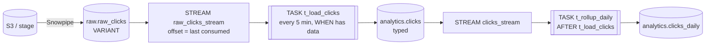

# 06-2 · Streams & tasks: the transformation pipeline

> **Level:** Intermediate · **Prerequisites:** [06-1 Continuous ingestion with Snowpipe](01_snowpipe_ingestion.md)
> **Time:** ~35 min · **Verified:** 2026-08-22 (Snowflake trial; Enterprise-only features flagged)

Raw JSON is landing in `raw.raw_clicks`. Now something has to turn it into typed rows in
`analytics.clicks` — repeatedly, forever, and **without rescanning the whole raw table
every time**. Rebuilding `analytics.clicks` from scratch every five minutes works on
10,000 rows and is unaffordable at a billion. You need to process only what changed,
which means two new objects: a **stream** that remembers what changed, and a **task**
that runs the SQL.



That shape — **ingest → raw → stream → task → modeled** — is the canonical Snowflake
pipeline. Everything below builds it.

---

## Streams: change data capture as a table

A stream is not a copy of your data. It's a **bookmark plus a view**: an offset into the
source table's version history, presented as the set of rows that changed since that
offset.

```sql
CREATE OR REPLACE STREAM linkstash_analytics.raw.raw_clicks_stream
  ON TABLE linkstash_analytics.raw.raw_clicks;

-- Just landed 3 rows via Snowpipe, and someone fixed one afterwards:
SELECT payload:slug::VARCHAR AS slug, METADATA$ACTION, METADATA$ISUPDATE, METADATA$ROW_ID
FROM linkstash_analytics.raw.raw_clicks_stream;
```

```
+--------+-----------------+-------------------+---------------------------+
| SLUG   | METADATA$ACTION | METADATA$ISUPDATE | METADATA$ROW_ID           |
|--------+-----------------+-------------------+---------------------------|
| abc123 | INSERT          | FALSE             | 8d1f...a2                 |
| xy9    | INSERT          | FALSE             | 4b70...c1                 |
| zzz    | DELETE          | TRUE              | 91ac...07                 |
| zzz    | INSERT          | TRUE              | 91ac...07                 |
+--------+-----------------+-------------------+---------------------------+
```

Three metadata columns, and the third row-pair is the one that trips people up:

| Column | Meaning |
|---|---|
| `METADATA$ACTION` | `INSERT` or `DELETE` — there is no `UPDATE` action |
| `METADATA$ISUPDATE` | `TRUE` when this row is *half of an update*: an `UPDATE` appears as a `DELETE` of the old version plus an `INSERT` of the new one, sharing a row id |
| `METADATA$ROW_ID` | Stable identifier for the source row across its versions — the key you join the pair on |

A stream shows the **net change** between the offset and now, not an event log: insert a
row and delete it before consuming, and the stream shows nothing at all. That's usually
what you want, and occasionally a surprise if you expected Kafka.

### Consuming a stream advances it — transactionally

This is *the* semantic to internalise:

- A plain `SELECT` from a stream **does not** move the offset. Query it as often as you like while debugging; it stays put.
- Using the stream inside a **DML statement** (`INSERT`, `MERGE`, `UPDATE`, `CREATE TABLE AS`) **consumes** it: on commit, the offset advances past everything the statement saw.
- The advance is part of the transaction. If the statement or transaction **rolls back, the offset does not move** and the same changes are still there next run.

Which is a much stronger guarantee than the queues you're used to. In
[08-3 of the FastAPI course](../../fastapi_complete/08_redis_caching_jobs/03_background_jobs_arq.md)
the honest contract was at-least-once, so every job had to be idempotent. Here the read
of the changes and the write of the result commit **atomically** — so a task that fails
halfway re-processes exactly the same rows, and even a non-idempotent
`SET count = count + n` is safe. Don't waste that: keep the read of the stream and the
write of the result in *one statement*.

The corollary: **a stream is single-consumer.** Two tasks reading one stream will steal
each other's changes. Two consumers = two streams on the same table (they're cheap —
metadata only).

### Staleness: the deadline you can miss

A stream can only reconstruct changes that the source table's **Time Travel** still
retains. Leave a stream unconsumed longer than the source's
`DATA_RETENTION_TIME_IN_DAYS` (1 day on trial/Standard, extended by
`MAX_DATA_EXTENSION_TIME_IN_DAYS`, default 14 days) and it goes **stale**: it returns
nothing useful and must be recreated — which resets the offset to *now* and silently
skips whatever happened in between.

```sql
SHOW STREAMS IN SCHEMA linkstash_analytics.raw;   -- columns: stale, stale_after, mode
```

Practical rule: a suspended task is a stream on a countdown. If you suspend a pipeline
over a long weekend, check `stale_after` before you resume it, and be ready to backfill
from `raw` (which you can, because `raw` is append-only and reloadable — the reason for
that design in [02-1](../02_sql_and_loading/01_databases_schemas_tables.md)).

### Three stream types

| Type | Syntax | Use |
|---|---|---|
| **Standard** | `ON TABLE t` | Full CDC: inserts, updates (as pairs), deletes. Default. |
| **Append-only** | `ON TABLE t APPEND_ONLY = TRUE` | Inserts only; updates/deletes ignored. Cheaper and simpler — **the right choice for an append-only landing table.** |
| **Insert-only** | `ON EXTERNAL TABLE t INSERT_ONLY = TRUE` | External tables over cloud storage: new files only. |

Streams also work on views (including secure views) and on directory tables. For
`raw_clicks`, which only ever receives inserts from Snowpipe, use append-only:

```sql
CREATE OR REPLACE STREAM linkstash_analytics.raw.raw_clicks_stream
  ON TABLE linkstash_analytics.raw.raw_clicks
  APPEND_ONLY = TRUE;      -- no DELETE rows to filter, no update pairs to reason about
```

---

## Tasks: the scheduler

```sql
CREATE OR REPLACE TASK linkstash_analytics.analytics.t_load_clicks
  WAREHOUSE = dev_wh
  SCHEDULE = '5 MINUTE'                    -- or: SCHEDULE = 'USING CRON 0 * * * * UTC'
  WHEN SYSTEM$STREAM_HAS_DATA('linkstash_analytics.raw.raw_clicks_stream')
AS
  SELECT 1;                                -- real body below
```

Four things to know before you write a real one:

**1. Tasks are created SUSPENDED.** This is the classic gotcha — you write a perfect
task, walk away, and nothing ever runs.

```sql
ALTER TASK linkstash_analytics.analytics.t_load_clicks RESUME;
SHOW TASKS IN SCHEMA linkstash_analytics.analytics;   -- state must read STARTED
```

`CREATE OR REPLACE TASK` also **suspends it again**, so every edit needs another
`RESUME`. Put the `RESUME` in the same script as the `CREATE`.

**2. `SCHEDULE` is an interval or a CRON.** `'5 MINUTE'` means "5 minutes after the
previous run finished-or-was-skipped", not a wall-clock slot; `'USING CRON 0 2 * * *
UTC'` means 02:00 UTC exactly. Use CRON when the time matters (daily rollups aligned to
a reporting boundary), intervals for "keep it fresh-ish". A run is skipped if the
previous one is still going — tasks never overlap themselves.

**3. The `WHEN SYSTEM$STREAM_HAS_DATA(...)` guard is a cost feature.** It's evaluated
before any compute starts: false → the run is recorded as `SKIPPED` and **the warehouse
is never resumed**. A task polling every 5 minutes over a quiet weekend costs
essentially nothing instead of 576 pointless 60-second warehouse resumes. Add the guard
to every stream-driven task; it is free money.

**4. Warehouse vs serverless.**

```sql
CREATE OR REPLACE TASK linkstash_analytics.analytics.t_load_clicks
  USER_TASK_MANAGED_INITIAL_WAREHOUSE_SIZE = 'XSMALL'   -- no WAREHOUSE = ... clause
  SCHEDULE = '1 MINUTE'
  WHEN SYSTEM$STREAM_HAS_DATA('linkstash_analytics.raw.raw_clicks_stream')
AS ...;
```

With `WAREHOUSE =`, every run pays your warehouse's **60-second minimum** — so a
one-second task on a 1-minute schedule bills like a warehouse that never sleeps.
Serverless tasks bill per second of actual work at a somewhat higher rate (~1.5×) and
Snowflake right-sizes them from observed history, which makes them cheaper for
**frequent, short** tasks and the better default for a trickle pipeline. Keep
`WAREHOUSE =` for chunky work on a warehouse that's already warm, or when you need the
run to land on a specific warehouse for cost attribution. (Serverless tasks need
`EXECUTE MANAGED TASK` on the account, granted by `ACCOUNTADMIN`.)

---

## The linkstash pipeline, end to end

Target table (typed, from [02-3](../02_sql_and_loading/03_semi_structured_json.md)):

```sql
CREATE OR REPLACE TABLE linkstash_analytics.analytics.clicks (
    click_id   NUMBER(38,0),          -- from the producer; our idempotency key
    slug       VARCHAR(32),
    clicked_at TIMESTAMP_NTZ,
    country    VARCHAR(2),
    user_agent VARCHAR,
    referrer   VARCHAR,
    modeled_at TIMESTAMP_NTZ DEFAULT CURRENT_TIMESTAMP()
);
```

The task body: cast the `VARIANT` and `MERGE`, reading the stream exactly once.

```sql
CREATE OR REPLACE TASK linkstash_analytics.analytics.t_load_clicks
  USER_TASK_MANAGED_INITIAL_WAREHOUSE_SIZE = 'XSMALL'
  SCHEDULE = '5 MINUTE'
  WHEN SYSTEM$STREAM_HAS_DATA('linkstash_analytics.raw.raw_clicks_stream')
AS
MERGE INTO linkstash_analytics.analytics.clicks AS tgt
USING (
    SELECT payload:click_id::NUMBER(38,0)       AS click_id,
           payload:slug::VARCHAR(32)            AS slug,
           payload:clicked_at::TIMESTAMP_NTZ    AS clicked_at,   -- ISO string → UTC timestamp
           payload:country::VARCHAR(2)          AS country,
           payload:user_agent::VARCHAR          AS user_agent,
           payload:referrer::VARCHAR            AS referrer
    FROM linkstash_analytics.raw.raw_clicks_stream                -- reading it here CONSUMES it
    -- Snowpipe can deliver the same event twice across files; collapse before MERGE,
    -- because MERGE errors if two source rows match one target row.
    QUALIFY ROW_NUMBER() OVER (PARTITION BY payload:click_id::NUMBER
                               ORDER BY loaded_at DESC) = 1
) AS src
  ON tgt.click_id = src.click_id
WHEN NOT MATCHED THEN INSERT (click_id, slug, clicked_at, country, user_agent, referrer)
     VALUES (src.click_id, src.slug, src.clicked_at, src.country, src.user_agent, src.referrer);
```

Why `MERGE` and not `INSERT ... SELECT`? Because [`PRIMARY KEY` isn't
enforced](../02_sql_and_loading/01_databases_schemas_tables.md) — dedupe is your job,
and `MERGE` makes the load convergent: replay it and you get the same table. (`WHEN
MATCHED THEN UPDATE` earns its place the day the producer starts sending corrections.)

Note there's no `WHERE METADATA$ACTION = 'INSERT'` — the append-only stream can't
produce anything else. On a standard stream you'd need it, plus a decision about what a
`DELETE` in raw should mean downstream.

### Add the rollup: a task DAG with `AFTER`

The daily aggregate must run *after* the load, on the same data. It can't read
`raw_clicks_stream` (already consumed — single consumer, remember), so give
`analytics.clicks` its own stream:

```sql
CREATE OR REPLACE TABLE linkstash_analytics.analytics.clicks_daily (
    slug VARCHAR(32), click_date DATE, clicks NUMBER(38,0)
);

CREATE OR REPLACE STREAM linkstash_analytics.analytics.clicks_stream
  ON TABLE linkstash_analytics.analytics.clicks APPEND_ONLY = TRUE;

CREATE OR REPLACE TASK linkstash_analytics.analytics.t_rollup_daily
  USER_TASK_MANAGED_INITIAL_WAREHOUSE_SIZE = 'XSMALL'
  AFTER linkstash_analytics.analytics.t_load_clicks      -- no SCHEDULE: the root owns timing
  WHEN SYSTEM$STREAM_HAS_DATA('linkstash_analytics.analytics.clicks_stream')
AS
MERGE INTO linkstash_analytics.analytics.clicks_daily AS d
USING (
    SELECT slug, clicked_at::DATE AS click_date, COUNT(*) AS clicks
    FROM linkstash_analytics.analytics.clicks_stream      -- consumed transactionally
    GROUP BY 1, 2
) AS s
  ON d.slug = s.slug AND d.click_date = s.click_date
-- Incrementing is safe *only* because the stream read and this write share one
-- transaction: a rollback leaves the offset untouched, so nothing double-counts.
WHEN MATCHED THEN UPDATE SET d.clicks = d.clicks + s.clicks
WHEN NOT MATCHED THEN INSERT (slug, click_date, clicks)
     VALUES (s.slug, s.click_date, s.clicks);
```

DAG rules worth memorising:

- One **root** task (the one with `SCHEDULE`); children declare `AFTER <parent>`. A child may have several parents and runs when all have finished.
- **Resume children first, then the root** — a suspended child is skipped, and resuming the root last means the DAG never runs half-wired.
- Suspend in the opposite order: root first.

```sql
ALTER TASK linkstash_analytics.analytics.t_rollup_daily RESUME;   -- children first
ALTER TASK linkstash_analytics.analytics.t_load_clicks  RESUME;   -- root last
```

### Run it now, and see what happened

```sql
EXECUTE TASK linkstash_analytics.analytics.t_load_clicks;   -- root: triggers the whole DAG once
```

Manual runs are how you test without waiting for the schedule; the `WHEN` guard is still
evaluated, so on an empty stream you'll simply get a `SKIPPED` row. Then:

```sql
SELECT name, scheduled_time, state, error_message,
       DATEDIFF(second, query_start_time, completed_time) AS secs
FROM TABLE(INFORMATION_SCHEMA.TASK_HISTORY(
        SCHEDULED_TIME_RANGE_START => DATEADD(hour, -2, CURRENT_TIMESTAMP())))
ORDER BY scheduled_time DESC;
```

```
+-----------------+---------------------+-----------+---------------+------+
| NAME            | SCHEDULED_TIME      | STATE     | ERROR_MESSAGE | SECS |
|-----------------+---------------------+-----------+---------------+------|
| T_ROLLUP_DAILY  | 2026-08-22 09:35:00 | SUCCEEDED | NULL          |    2 |
| T_LOAD_CLICKS   | 2026-08-22 09:35:00 | SUCCEEDED | NULL          |    4 |
| T_LOAD_CLICKS   | 2026-08-22 09:30:00 | SKIPPED   | NULL          |    0 |
+-----------------+---------------------+-----------+---------------+------+
```

`SKIPPED` is the guard doing its job (no stream data, no compute). `state = FAILED` with
an `error_message` is where you'll live when a producer changes a field's type. Note
tasks **auto-suspend after repeated failures** (`SUSPEND_TASK_AFTER_NUM_FAILURES`, 10 by
default) — which is a good default and another reason your pipeline needs an alert on
`TASK_HISTORY`, not just on the data.

---

## The declarative alternative: dynamic tables

Everything above is *imperative*: you wrote how to compute the delta, when, and where to
put it. A **dynamic table** flips that — you declare the query and how fresh you want
it, and Snowflake works out the incremental refresh:

```sql
CREATE OR REPLACE DYNAMIC TABLE linkstash_analytics.analytics.clicks_dt
  TARGET_LAG = '5 minutes'      -- or 'DOWNSTREAM': refresh only when something needs me
  WAREHOUSE  = dev_wh
AS
SELECT payload:click_id::NUMBER(38,0)    AS click_id,
       payload:slug::VARCHAR(32)         AS slug,
       payload:clicked_at::TIMESTAMP_NTZ AS clicked_at,
       payload:country::VARCHAR(2)       AS country
FROM linkstash_analytics.raw.raw_clicks;
```

No stream, no task, no `MERGE`, no `RESUME` — and chaining dynamic tables gives you a
dependency graph Snowflake schedules for you. This is the modern answer for most
*transformation* work, and if you're starting a new model today it deserves to be your
first choice.

Where streams + tasks still win:

- **Side effects and non-SQL-shaped work** — calling a stored procedure, sending an alert, unloading to S3, running a `CALL` on a Python UDF. A dynamic table can only *be* the result of a query.
- **Custom merge logic** — SCD-type-2 history, deliberate late-arrival handling, "increment this counter", writes to several targets from one change set.
- **Exact control of when and on what** — CRON alignment to a reporting boundary, a specific warehouse, ordering guarantees between steps.
- **Queries whose refresh can't be incremental** — some constructs force a full refresh, which quietly turns a dynamic table into a rebuild-every-lag-window bill. Check `DYNAMIC_TABLE_REFRESH_HISTORY` before assuming it's incremental.

And when the modeling layer grows past a handful of tables, most teams reach for
**dbt** rather than either: SQL models in Git, `ref()`-derived lineage, tests
(`unique`, `not_null`, freshness) that fail the build, environments, and generated docs.
dbt runs *on* Snowflake — it compiles to the same SQL you've been writing and can
materialise models as tables, views, incremental models, or dynamic tables — so nothing
here is wasted; you're just no longer hand-maintaining a task DAG and its `RESUME`
order. Rule of thumb: **streams + tasks for pipeline plumbing and side effects, dynamic
tables for simple derived tables, dbt once "the models" is a project rather than a
handful of statements.**

---

## Recap & next

- ✅ A **stream** is an offset + a view of net changes, with `METADATA$ACTION` /
  `METADATA$ISUPDATE` / `METADATA$ROW_ID`; an `UPDATE` shows up as a DELETE+INSERT pair.
- ✅ **`SELECT` doesn't advance it; DML does — transactionally.** Rollback leaves the
  offset put, so read-and-write in one statement and you get exactly-once processing.
  One stream, one consumer.
- ✅ Streams go **stale** past the source table's retention (1 day on trial) — a
  long-suspended task is a data-loss risk; check `stale_after`.
- ✅ **Append-only** streams for landing tables (no pairs to reason about); standard for
  full CDC; insert-only for external tables.
- ✅ Tasks: `SCHEDULE` (interval or CRON), **created suspended → `ALTER TASK ... RESUME`**
  (and again after every `CREATE OR REPLACE`), `AFTER` for DAGs (children resumed first),
  serverless vs `WAREHOUSE =` (60-second minimum) for frequent short runs.
- ✅ **`WHEN SYSTEM$STREAM_HAS_DATA(...)`** makes idle runs `SKIPPED` with no warehouse
  resume — the cheapest line in your pipeline.
- ✅ Built it: `raw_clicks → stream → MERGE task → analytics.clicks → stream → rollup task`,
  monitored with `TASK_HISTORY` and forced with `EXECUTE TASK`.
- ✅ **Dynamic tables** (declare query + `TARGET_LAG`) for derived tables; **dbt** for a
  real model DAG; streams + tasks when you need imperative control or side effects.

## Exercises

1. Your `t_load_clicks` task has been failing for an hour — a producer started sending
   `clicked_at` as an epoch integer and the `::TIMESTAMP_NTZ` cast errors. What has
   happened to the stream, what will happen if you leave it broken until Monday, and how
   do you fix the load without losing rows?

<details>
<summary>Solution</summary>

**The stream is fine, and full.** Every failed run rolled back, so the offset never
moved and all those changes are still pending — that's the transactional consumption
guarantee earning its keep. Nothing is lost yet.

Left until Monday, the risk is **staleness**: the stream can only reconstruct changes
still inside `raw_clicks`'s Time Travel window (1 day on trial). Past that it goes
stale, and recreating it resets the offset to *now* — skipping the weekend.

The fix, in order:

```sql
-- 1. Stop the alert noise (and the retry churn) while you work.
ALTER TASK linkstash_analytics.analytics.t_load_clicks SUSPEND;

-- 2. Inspect the offending rows WITHOUT consuming the stream — SELECT is safe.
SELECT payload:clicked_at FROM linkstash_analytics.raw.raw_clicks_stream LIMIT 20;

-- 3. Make the cast tolerant of both shapes, in the task body:
--    TRY_TO_TIMESTAMP_NTZ on the string, epoch fallback for numbers.
COALESCE(
    TRY_TO_TIMESTAMP_NTZ(payload:clicked_at::VARCHAR),
    TO_TIMESTAMP_NTZ(TRY_TO_NUMBER(payload:clicked_at::VARCHAR))
) AS clicked_at

-- 4. CREATE OR REPLACE TASK re-suspends it — resume, then force one run.
ALTER TASK linkstash_analytics.analytics.t_load_clicks RESUME;
EXECUTE TASK linkstash_analytics.analytics.t_load_clicks;
```

If the stream *had* gone stale, the recovery path exists precisely because `raw` is
append-only and reloadable: recreate the stream, then backfill `analytics.clicks` with a
one-off `MERGE` reading `raw_clicks` directly over the gap window. Keeping raw data
raw is what makes that possible.

Worth noting: `TRY_TO_*` returning `NULL` instead of erroring is often the better
default in a pipeline — the task keeps running and you catch the nulls with a data test,
rather than the whole load stopping on one malformed field.

</details>

2. Someone asks for a second consumer of new raw clicks — an hourly task that writes
   suspicious clicks to `analytics.click_alerts`. Why can't it read
   `raw_clicks_stream`, and would you use a dynamic table instead?

<details>
<summary>Solution</summary>

Because a stream is **single-consumer**: whichever task's DML commits first advances the
offset, and the other silently sees only what's left. The two tasks would split the data
between them at random — the worst kind of bug, since both "work".

Give the second consumer its own stream on the same table; they're metadata objects with
independent offsets:

```sql
CREATE OR REPLACE STREAM linkstash_analytics.raw.raw_clicks_alert_stream
  ON TABLE linkstash_analytics.raw.raw_clicks APPEND_ONLY = TRUE;
```

Dynamic table instead? If "suspicious clicks" is just a filter over the data, yes —
`CREATE DYNAMIC TABLE ... TARGET_LAG = '1 hour' AS SELECT ... WHERE <suspicious>` is
less machinery and can't get its `RESUME` order wrong. Keep the stream + task if the
alert has a **side effect** (send an email, call a webhook, `CALL` a procedure), because
a dynamic table can only produce a table.

</details>

**→ Next: [06-3 · Time Travel, zero-copy clones & where to go next](03_time_travel_clones_and_next.md)**
